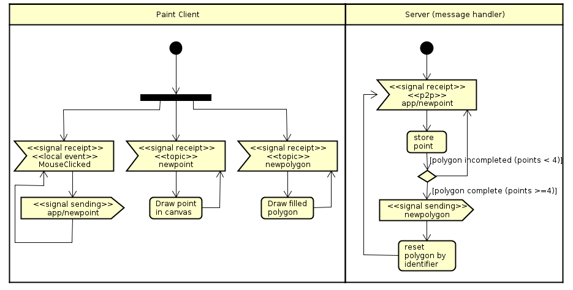

### Escuela Colombiana de Ingeniería
### Arquitecturas de Software - ARSW
### Laboratorio - Broker de Mensajes STOMP con WebSockets + HTML5 Canvas.

#### - Daniela González

### - [Link de heroku](https://lab6-arsw.herokuapp.com/) 

# Descripción arquitectura

La arquitectura está compuesta por un cliente STOMP en un módulo de Javascript y SpringBoot configurado como Broker de mensajes, el cliente se suscribe a dos tópicos (newpoint, newpolygon) y un RestAPI captura las peticiones (puntos), las propaga y cuando se completen cuatro o más puntos, publica el polígono. La aplicación es concurrente y permite que varios clientes colaboren en el mismo dibujo.

